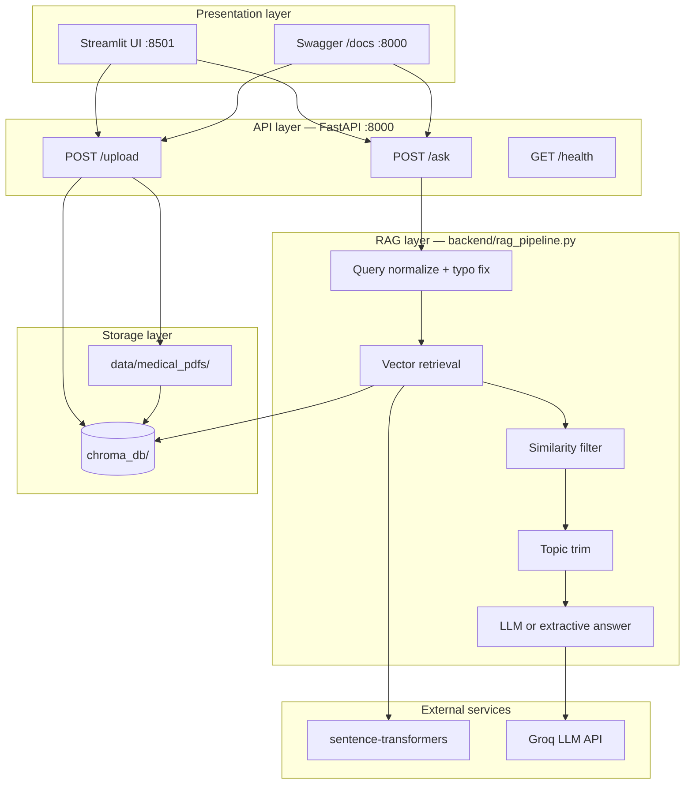

# Medical RAG — Medical Question Answering System

AI-powered medical Q&A using **RAG (Retrieval-Augmented Generation)**. Doctors ask questions in natural language; answers come **only** from uploaded PDFs. If the answer is not in the documents, the system replies:

> **I don't know based on the provided medical data.**

---

## Demo video

🎬 **[Watch project demo](https://drive.google.com/file/d/1IOOLbdJI7gzts4QCAiDLjkca5R-DN2AL/view?usp=sharing)**

---

## What was built

### Backend (FastAPI)

- **POST /ask** — ask a medical question, get answer + source + page + similarity score
- **POST /upload** — upload a PDF and index it into ChromaDB (used via Swagger **Try it out**)
- **GET /health** — API status and LLM configuration check

### RAG pipeline

- PDF text extraction (`PyPDFLoader`)
- Chunking: size **500**, overlap **100**
- Embeddings: **sentence-transformers** (`all-MiniLM-L6-v2`)
- Vector store: **ChromaDB** (cosine similarity, top-5 chunks)
- Similarity threshold: **0.75** — below this → "I don't know"
- Strict LLM prompt — context-only answers, no external knowledge
- **Extractive fallback** — when LLM fails, show matching text from the PDF (not a false "I don't know")
- Typo correction before search (e.g. `asthama` → `asthma`)
- Answers use chunks from **one PDF only** (avoids mixing fever + asthma text)

### Frontend (Streamlit)

- Doctor dashboard at **http://127.0.0.1:8501**
- Ask questions, view answers and citations
- PDF upload from sidebar
- Chat history, dark mode, API status in sidebar

### Documents indexed

- `sample_medical_reference.pdf` — asthma & hypertension (sample)
- `Fever_Management_Guidelines.pdf` — fever guidelines (uploaded via **POST /upload**)

### Scripts & config

- `start_all.ps1` — starts API (8000) and Streamlit (8501) on Windows
- `run_api.ps1`, `run_frontend.ps1`
- `.env` — API keys and settings (from `.env.example`)
- `Dockerfile`, `docker-compose.yml`

---

## Tech stack

| Component   | Tool                                       |
| ----------- | ------------------------------------------ |
| Backend     | Python, FastAPI, LangChain                 |
| Frontend    | Streamlit                                  |
| Vector DB   | ChromaDB                                   |
| Embeddings  | sentence-transformers (`all-MiniLM-L6-v2`) |
| LLM         | Groq (OpenAI-compatible API)               |
| PDF parsing | PyPDF                                      |

---

## Project structure

```
medical-rag/
├── backend/
│   ├── main.py
│   ├── rag_pipeline.py
│   ├── ingest.py
│   ├── prompt.py
│   ├── config.py
│   └── utils.py
├── frontend/
│   └── app.py
├── data/medical_pdfs/
├── chroma_db/
├── scripts/create_sample_pdf.py
├── start_all.ps1
├── requirements.txt
├── .env
└── .env.example
```

---

## How to run (Windows)

```powershell
cd medical-rag
.\.venv\Scripts\Activate.ps1
.\start_all.ps1
```

| URL                        | Purpose                             |
| -------------------------- | ----------------------------------- |
| http://127.0.0.1:8000/docs | Swagger — test `/ask` and `/upload` |
| http://127.0.0.1:8501      | Streamlit UI                        |

Keep both terminal windows open.

### First-time setup

```powershell
python -m venv .venv
.\.venv\Scripts\Activate.ps1
pip install -r requirements.txt
copy .env.example .env
# Edit .env — add OPENAI_API_KEY (Groq key)

$env:PYTHONPATH = "."
python -m backend.ingest
```

---

## How to use

1. Start servers with `.\start_all.ps1`
2. Upload PDFs: Swagger **POST /upload** or Streamlit sidebar
3. Ask questions in Streamlit or Swagger **POST /ask**

Example question body:

```json
{ "question": "What is fever?" }
```

Example response fields: `answer`, `source`, `page`, `score`, `mode` (`llm` or `extractive`)

---

## Environment variables (.env)

```env
OPENAI_API_KEY=your_groq_api_key
OPENAI_MODEL=llama-3.1-8b-instant
OPENAI_BASE_URL=https://api.groq.com/openai/v1
SIMILARITY_THRESHOLD=0.75
API_URL=http://localhost:8000
```

Do not set `SIMILARITY_THRESHOLD` below `0.75` — weak matches can return wrong or mixed document text.

---

## Architecture (full details)

### 1. High-level system view

The system has two main flows: **indexing PDFs** (offline / on upload) and **answering questions** (real-time).



---

### 2. Layers and responsibilities

| Layer            | Files                     | Role                                                                                   |
| ---------------- | ------------------------- | -------------------------------------------------------------------------------------- |
| **Frontend**     | `frontend/app.py`         | Doctor types a question; calls FastAPI; shows answer, source PDF, page, confidence bar |
| **API**          | `backend/main.py`         | HTTP endpoints, request validation (Pydantic), CORS, file upload                       |
| **RAG pipeline** | `backend/rag_pipeline.py` | Retrieve chunks → filter → generate grounded answer                                    |
| **Ingestion**    | `backend/ingest.py`       | PDF → text → chunks → embeddings → ChromaDB                                            |
| **Prompts**      | `backend/prompt.py`       | Strict system/user prompts (context-only)                                              |
| **Config**       | `backend/config.py`       | Paths, thresholds, API keys from `.env`                                                |
| **Utilities**    | `backend/utils.py`        | Similarity math, typo fixes, extractive answer builder                                 |

---

### 3. PDF ingestion flow (indexing)

When you run `python -m backend.ingest` or call **POST /upload**, this pipeline runs:

```
PDF file (data/medical_pdfs/)
        ↓
PyPDFLoader — extract text per page
        ↓
RecursiveCharacterTextSplitter
   • chunk_size = 500 characters
   • chunk_overlap = 100 characters
        ↓
For each chunk, store metadata:
   • source  → filename (e.g. Fever_Management_Guidelines.pdf)
   • page    → page number (1-based)
   • chunk_id → unique id (filename_p{page}_c{index})
        ↓
sentence-transformers (all-MiniLM-L6-v2)
   → convert each chunk to a vector (embedding)
        ↓
ChromaDB collection "medical_documents"
   • stored on disk in chroma_db/
   • similarity metric: cosine
```

**Re-upload behavior:** If the same filename is uploaded again, old chunks for that file are deleted first, then new chunks are added (no duplicates).

---

### 4. Question answering flow (RAG)

When a doctor asks **"What is fever?"** via Streamlit or **POST /ask**:

#### Step 1 — Request enters API

- `main.py` receives JSON: `{ "question": "..." }`
- Question is validated (length 1–2000 chars)
- `MedicalRAGPipeline.generate_answer()` is called

#### Step 2 — Query preparation

- **Sanitize:** trim whitespace, limit length
- **Normalize typos:** e.g. `asthama` → `asthma` before search (see `utils.normalize_medical_query`)

#### Step 3 — Vector retrieval

- Question is embedded with the **same model** used at ingest time
- ChromaDB returns **top 5** most similar chunks (cosine distance)
- Each chunk gets a **similarity score**: `1 - distance` (0 to 1)
- Chunks are sorted by score (highest first)

#### Step 4 — Similarity gate (hallucination prevention)

- If **best score < 0.75** (`SIMILARITY_THRESHOLD`) → return immediately:
  - `"I don't know based on the provided medical data."`
- No LLM is called; no guess from weak matches

#### Step 5 — Chunk filtering

- Keep only chunks with score ≥ 0.75
- Use chunks from the **best-matching PDF only** (max 1 chunk)
- Prevents mixing asthma text + fever text in one answer

#### Step 6 — Topic trimming (optional)

- If one chunk contains multiple sections (e.g. ASTHMA + HYPERTENSION in sample PDF)
- Pipeline extracts only the section that matches the question topic
- Reduces irrelevant text sent to the LLM

#### Step 7 — Answer generation (two modes)

**Mode A — LLM (`mode: "llm"`)**  
When Groq API key is set and the call succeeds:

```
System prompt  → "Answer ONLY from context..."
User prompt    → Retrieved chunk text + doctor's question
        ↓
Groq (llama-3.1-8b-instant) via LangChain ChatOpenAI
        ↓
Short, professional answer grounded in the chunk
```

If the model still says it does not know → mapped to the standard refusal message.

**Mode B — Extractive (`mode: "extractive"`)**  
When LLM is missing, quota exceeded, or API error:

```
Top matching chunk text is returned directly
(prefixed with "Based on the provided medical documents:")
        ↓
Still grounded — no invented medical facts
```

#### Step 8 — Response to client

```json
{
  "question": "What is fever?",
  "answer": "...",
  "source": "Fever_Management_Guidelines.pdf",
  "page": 1,
  "score": 0.79,
  "sources": [ { "source", "page", "score", "chunk_id" } ],
  "grounded": true,
  "mode": "llm",
  "notice": null
}
```

Streamlit displays `answer`, citation box (document + page), and a progress bar for `score`.

---

### 5. End-to-end diagram (ask path)

```
Doctor question: "What is fever?"
        │
        ▼
┌───────────────────┐
│  Streamlit :8501   │  POST http://localhost:8000/ask
└─────────┬─────────┘
          ▼
┌───────────────────┐
│  FastAPI :8000    │  main.py → rag_pipeline.py
└─────────┬─────────┘
          ▼
   Normalize query ("fever" typos fixed)
          ▼
   Embed question → search ChromaDB (top 5)
          ▼
   Best score = 0.79  ≥  0.75 ?  ──NO──► "I don't know..."
          │ YES
          ▼
   Filter: 1 chunk from Fever_Management_Guidelines.pdf
          ▼
   Trim topic section (if needed)
          ▼
   ┌──────┴──────┐
   │ LLM OK?     │
   └──┬──────┬───┘
      YES    NO
       │      │
       ▼      ▼
   Groq    Copy chunk
   summary  text
       │      │
       └──┬───┘
          ▼
   JSON answer + source + page + score
```

---

### 6. Hallucination prevention (how it works)

| #   | Mechanism                       | What it does                                                 |
| --- | ------------------------------- | ------------------------------------------------------------ |
| 1   | **Similarity threshold (0.75)** | Weak matches never reach the LLM                             |
| 2   | **Strict prompts**              | LLM instructed to use context only; fixed refusal phrase     |
| 3   | **Refusal detection**           | If model hedges, response is normalized to "I don't know..." |
| 4   | **Single-document chunks**      | One PDF per answer — no cross-document mixing                |
| 5   | **Topic trimming**              | Multi-topic chunks cut to the relevant section               |
| 6   | **Extractive fallback**         | When LLM fails, show PDF text — do not fabricate an answer   |
| 7   | **No empty retrieval**          | Zero chunks → immediate refusal                              |

---

### 7. Data stored on disk

| Path                 | Contents                                                     |
| -------------------- | ------------------------------------------------------------ |
| `data/medical_pdfs/` | Original PDF files                                           |
| `chroma_db/`         | Vector index + SQLite metadata (persistent between restarts) |
| `.env`               | API keys, threshold, model names (not committed to git)      |

---

### 8. Ports and services

| Port     | Service             | Started by                           |
| -------- | ------------------- | ------------------------------------ |
| **8000** | FastAPI + Swagger   | `run_api.ps1` / `start_all.ps1`      |
| **8501** | Streamlit dashboard | `run_frontend.ps1` / `start_all.ps1` |

Streamlit only talks to the backend; it does not query ChromaDB or the LLM directly.
